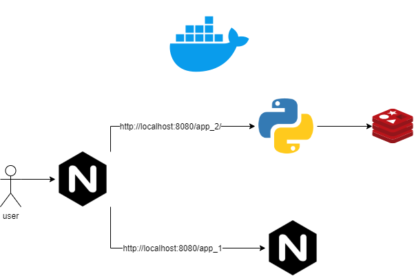

# Docker Example

This example shows the use of Docker files to create different images and finally use Docker Compose to create the different containers for this architecture. With the reverse proxy we can access two different applications depending on the url. An application that displays a static web page and another application that uses a redis database to store information.

## Usage
You must enter each folder of each project and execute the following command. The following command must be run to build the image. 

The image will have a nginx that will run a static web page. 

```shell
docker build -t nginxserver .
```

Then the same command must be executed with the python application and the reverse proxy 

```shell
docker build -t pythonflask .
docker build -t nginxproxy .

```

Finally, docker compose must be run with the following command:

```shell
docker-compose up -d
```

## Architecture
Docker compose will build an architecture like the following image:

 

The application works as follows:
* If you put the following http://localhost:8080/app_1/ in the browser, the static web page will be displayed.
* If you put the following http://localhost:8080/app_2 in the browser, a message from the web application will be displayed.
* If you put http://localhost:8080/app_2/set/your_name in the browser, an updated name message will be displayed.
* If you put http://localhost:8080/app_2/get in the browser, it will display a message with name previously entered.

## Authors

* **Luis Antonio Sic** - *Tecnologia Transaccional* - [sluis117](https://github.com/LuisSic)


## License

This project is licensed under the MIT License - see the [LICENSE.md](LICENSE.md) file for details.

